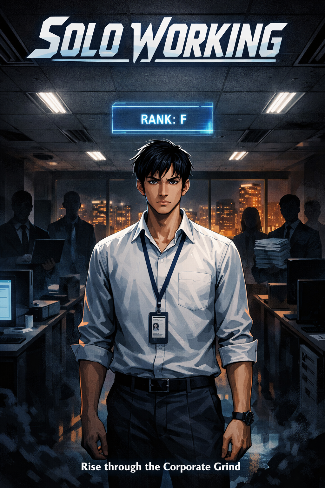

# Solo Working: A Corporate Office Parody Novel Inspired by Solo Leveling

**Tagline:** _"In a world where only the strong survive, I — a rank-F employee — was chosen by the System. Not to save the world. To finish the report by 5 PM."_



**Solo Working** is a completed Filipino office parody web novel that reimagines the epic manhwa *Solo Leveling* within the fluorescent-lit world of corporate Manila. Follow Juan dela Cruz, a perpetually-overlooked Rank-F employee at Pinnacle Systems Inc., as he awakens a mysterious Work System and begins his ruthless, spreadsheet-assisted ascent to become the most feared professional in the company.

A dark comedy for anyone who has survived corporate grind culture, office hierarchies, and the absurd pressure of deadline-driven project management.

---

## About Solo Working — Complete Office Parody Novel

**Solo Working** is a finished 25-chapter web serial novel that blends the dramatic progression system and dark storytelling of *Solo Leveling* with cutting-edge corporate office comedy and Filipino workplace culture.

### The Story
Set in BGC, Manila at a mid-sized IT services company, the narrative follows Juan dela Cruz — an invisible Rank-F associate — who survives a catastrophic system migration project that breaks every other employee. In the aftermath, only Juan remains unchanged, and a mysterious **Work System** awakens inside him, granting extraordinary abilities:

- **Raise:** Convert burned-out coworkers into loyal, tireless Shadow Workers
- **Rise:** Summon Shadow Workers for active duty with perfection
- **Rank Up:** Progress from F-rank invisibility to S-rank untouchable status

The novel treats office deadlines, performance reviews, and quarterly reports with the same dramatic gravity as epic fantasy battles — except the protagonist never breaks character, and neither does the world around him.

### Perfect For
- **Readers interested in:** Office comedy, dark humor, Filipino literature, LitRPG systems, corporate satire, *Solo Leveling* fan fiction
- **Age group:** Adults 18–35, especially those with corporate work experience
- **Keywords:** Office parody novel, corporate fantasy, Filipino fiction, workplace comedy, system progression, web serial, *Solo Leveling* inspired

**Word Count:** ~27,500 words (25 complete chapters)
**Format:** Web serial, chapter-based
**Status:** ✅ FINISHED & READY TO READ

---

## Project Structure & File Guide

Navigate the complete *Solo Working* project:

```
solo_working/
├── README.md                           # Project overview (you are here)
├── memory/
│   └── constitution.md                 # Creative bible: tone, character rules, worldbuilding
├── stories/
│   └── solo-working/
│       ├── specification.md            # Full narrative structure & arc breakdowns
│       ├── content/                    # 25 complete chapters
│       │   ├── chapter-01.md           # Arc 0: The Weakest in the Office (Prologue)
│       │   ├── chapter-02.md through chapter-24.md
│       │   └── chapter-25.md           # Arc 3: The First Commit (Epilogue)
│       └── assets/
│           ├── prompt.md               # ChatGPT 5 cover art generation prompt
│           └── cover_art.png           # Official cover illustration
```

---

## Key Project Files Explained

### 📖 `memory/constitution.md` — The Creative Bible
The authoritative guide to Solo Working's voice, rules, and values. Contains:
- **Core Creative Values:** Themes of dignity in corporate grind, absurdity of hustle culture
- **Narrative Voice Rules:** Dead serious tone inspired by Solo Leveling manhwa, juxtaposition-based humor
- **Language & Cultural Flavor:** Filipino workplace dynamics, untranslated Tagalog phrases, dual commands ("Rise" vs "Raise!")
- **Character Archetypes:** Juan dela Cruz protagonist profile, Shadow Workers system, supporting cast roles
- **Worldbuilding Logic:** Rank system mechanics, Work System rules, corporate dungeon metaphors

→ **Read this if:** You're writing fan fiction, understanding the tone, or continuing the project

### 📝 `stories/solo-working/specification.md` — Full Story Breakdown
Complete narrative architecture including logline, premise, one-page summary, and four-arc structure:
- **Arc 0 (Ch 1–3):** Rank-F invisibility, Project Skyfall incident, System awakening
- **Arc 1 (Ch 4–10):** First dungeon (Q3 Report), first Shadow Worker raised, "Raise!" command introduced
- **Arc 2 (Ch 11–20):** Client pitch dungeon, corporate politics, Senior Manager antagonist
- **Arc 3 (Ch 21–25):** Audit and investigation, Isabel Reyes character arc, system transformation epilogue

→ **Read this if:** You want the full plot structure, character progression, or story development notes

### 📚 `stories/solo-working/content/` — All 25 Chapters
Complete finished novel ready to read or publish:
- **Chapter 1–3:** Introduction, character establishment, System awakening at Pinnacle Systems Inc.
- **Chapter 4–10:** First quest arc, Shadow Worker recruitment, Rodel's transformation
- **Chapter 11–20:** High-stakes client project, Cynthia's character arc, corporate conflict
- **Chapter 21–25:** Investigation subplot, Isabel Reyes reveal, epilogue and transformation

**Total Word Count:** ~27,500 words of finished fiction

→ **Read this if:** You want the complete solo working novel experience

---

## Core Concept — What Makes Solo Working Unique

### The Work System (LitRPG Mechanics)
Juan's awakened abilities follow an office-themed progression system inspired by Solo Leveling:

| Element | Office Version | Function |
|---------|---|---|
| **Dungeons** | High-stakes projects (Q3 Report, Client Pitch, System Audit) | Progression opportunities |
| **Rank System** | F (weakest) to S (untouchable) | Employee status progression |
| **Shadow Soldiers** | Shadow Workers (raised coworkers) | Loyal, tireless team members |
| **Quests** | System-assigned tasks | Mandatory mission-based objectives |
| **Commands** | "Rise" (summon) / "Raise!" (create) | Activation and conversion powers |
| **Penalties** | Lost FOCUS, Shadow Audits, termination threat | Real stakes for failure |

### Juan dela Cruz — The Protagonist
**Age:** 27  
**Position:** Rank-F Associate, IT Services Division  
**Personality:** Invisible, methodical, unflinching under pressure  
**Superpower:** When he survives what breaks others, he awakens the Work System  
**Character Arc:** From corporate ghost to system architect responsible for dismantling toxic hierarchies

### Pinnacle Systems Inc. — The Setting
A mid-sized IT services company in BGC, Taguig (Manila). The 11th floor becomes a modern dungeon:
- **Atmosphere:** Fluorescent merciless lighting, low ceilings, oppressive open-plan layout
- **Culture:** Rank-obsessed, performance-driven, deadline-centric
- **Metaphor:** Every project is treated as a life-or-death battle; every employee is ranked on a hierarchy no one fully understands

---

## Themes & What Solo Working Explores

- 🎯 **Dignity in the Grind:** Office work deserves the same narrative weight, heroic language, and character development as world-ending fantasy battles
- 😤 **Absurdity of Hustle Culture:** The System rewards relentless productivity while demanding everything from workers; power comes at the cost of overtime
- 🇵🇭 **Filipino Workplace Culture:** Bayanihan (communal work spirit), pakikisama (group harmony), the art of invisible support, untranslated Tagalog authenticity
- 🤐 **Quiet Power Over Loud Ambition:** The absurd triumph of staying calm, methodical, and patient while everyone else breaks under pressure
- 📊 **Systemic Inequality:** Rank-based hierarchies, invisible labor, and the journey from F-tier invisibility to legitimate authority

---

## Tone

Dead serious. No winking at the audience. The humor lives in **juxtaposition** — the reader laughs at the contrast between epic fantasy narration and mundane office tasks; the protagonist never does.

Inspired by *Solo Leveling*'s narrative voice but transplanted entirely into Manila's corporate landscape.

---

## Project Status

✅ **COMPLETE**

- Constitution: Finalized
- Specification: Finalized
- All 25 chapters: Written & completed
- Cover art: Generated
- Ready for editing, formatting, and publication

---

## Next Steps — How to Use This Project

### 👉 **Want to Read the Novel?**
Start with **[Chapter 1: The Weakest in the Office](./stories/solo-working/content/chapter-01.md)** for the full 25-chapter experience (~2–3 hours reading time).

### ✍️ **Want to Adapt, Fan-Fic, or Continue?**
1. Read `memory/constitution.md` first (tone, character rules, forbidden phrases)
2. Review `stories/solo-working/specification.md` for arc structure
3. Check the last chapter for where the story ends
4. Write in the same voice, respecting the core values

### 📢 **Want to Publish or Share?**
- **Web Serial Platforms:** Ready for Wattpad, RoyalRoad, or similar (just upload chapters)
- **Social Media:** Use the cover art + logline for promotion
- **Self-Publishing:** Compiled chapters ready for formatting as eBook or print

### 🎨 **Want to Commission More Art?**
The **`assets/prompt.md`** contains a detailed, tested prompt for AI art generation. Modify as needed for variant covers, chapter illustrations, or character art.

---

## Publishing & Distribution Ideas

| Format | Status | Next Step |
|--------|--------|-----------|
| **Web Serial** (Wattpad/RoyalRoad) | 📦 Ready | Upload chapters + weekly schedule |
| **Self-Published eBook** (Amazon KDP) | 📦 Ready | Format chapters, add front matter, create thumbnail |
| **Audiobook** | 🔄 Future | Hire narrator, record 27,500 words |
| **Tagalog Translation** | 🔄 Future | Hire Filipino translator, preserve wordplay |
| **Merch** (Office humor apparel) | 🔄 Future | Design "Rise" & "Raise!" branded items |

---

---

## Project Metadata

**Genre:** Office Parody / Corporate Fantasy / LitRPG / Filipino Fiction  
**Inspiration:** *Solo Leveling* (manhwa) + Corporate office culture  
**Setting:** BGC, Manila — Present day IT services company  
**Tone:** Dark comedy, dead serious narration, juxtaposition-based humor  
**Status:** ✅ Complete & Ready  
**Total Word Count:** ~27,500 words  
**Chapter Count:** 25 finished chapters  
**Language:** English (with Filipino cultural flavor)  
**Audience Age:** 18–35 (especially corporate workers & Solo Leveling fans)

---

## Author's Note — Who Is This For?

This novel is written for anyone who has ever:

> - Stayed until 8 PM finishing a report while the office emptied around you
> - Watched a brilliant coworker break under impossible expectations
> - Realized you were doing three people's jobs for one person's salary
> - Felt invisible in a rank-obsessed corporate hierarchy
> - Muttered something in Tagalog at an Excel spreadsheet at 4:47 PM
> - Wondered if quiet competence could ever beat loud ambition

**You are the protagonist now.**

---

**Last Updated:** April 6, 2026  
**Project Status:** FINALIZED & READY FOR DISTRIBUTION

For detailed worldbuilding, creative rules, and character quirks, see `memory/constitution.md`  
For plot specifics and arc breakdowns, see `stories/solo-working/specification.md`
